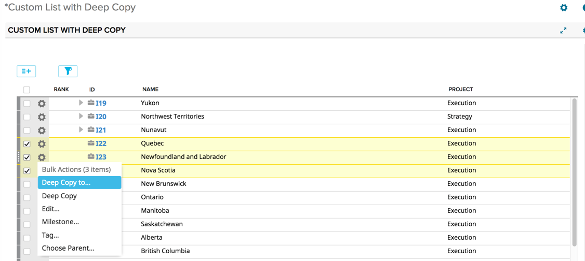

#Custom List with Deep Copy

## Summary/Description

This is a custom list app with additional bulk menu items that include: 
* "Deep Copy"
* "Deep Copy To..."

Deep Copy will do a deep copy of all selected items into the same projects they are in.  

Deep Copy To... will do a deep copy of all selected items to the selected parent object.  
Note that this option is only available if *all items of the same type are selected and the items have a 
parent type*.  For example, this option won't be avilable for the highest level portfolio item 
becuase there is no Parent type.  

The eligible types for both of these menu options are all portfolio item types and user stories.
  
Items at any level user story or above can be selected for a deep copy.  
*Note that for the "Deep Copy" option, all items that are selected will be copied.  Thus, if you select a Feature AND the User Story beneath it, the Feature will be deep copied and the User Story will also be deep copied. 
  This will result in 2 new copies of the selected User Story -- one underneath the selected copied feature, and one standalone* 
  

User stories can only be deep copied to the lowest level portfolio items. 
 
Each item will be copied to the same project that they reside in.   

Child user stories and tasks will be copied during the deep copy.  

The following fields are NOT copied during a deep copy: 
* Attachments
* Tags
* Discussion
* Milestones

The following object types are NOT copied during a deep copy: 
* Test Cases
* Defects
* Defect Suites

## App Settings
In the app settings, configure the top level artifact type for the grid.  

## Development Notes

### First Load

If you've just downloaded this from github and you want to do development, 
you're going to need to have these installed:

 * node.js
 * grunt-cli
 * grunt-init
 
Since you're getting this from github, we assume you have the command line
version of git also installed.  If not, go get git.

If you have those three installed, just type this in the root directory here
to get set up to develop:

  npm install

### Structure

  * src/javascript:  All the JS files saved here will be compiled into the 
  target html file
  * src/style: All of the stylesheets saved here will be compiled into the 
  target html file
  * test/fast: Fast jasmine tests go here.  There should also be a helper 
  file that is loaded first for creating mocks and doing other shortcuts
  (fastHelper.js) **Tests should be in a file named <something>-spec.js**
  * test/slow: Slow jasmine tests go here.  There should also be a helper
  file that is loaded first for creating mocks and doing other shortcuts 
  (slowHelper.js) **Tests should be in a file named <something>-spec.js**
  * templates: This is where templates that are used to create the production
  and debug html files live.  The advantage of using these templates is that
  you can configure the behavior of the html around the JS.
  * config.json: This file contains the configuration settings necessary to
  create the debug and production html files.  
  * package.json: This file lists the dependencies for grunt
  * auth.json: This file should NOT be checked in.  Create this to create a
  debug version of the app, to run the slow test specs and/or to use grunt to
  install the app in your test environment.  It should look like:
    {
        "username":"you@company.com",
        "password":"secret",
        "server": "https://rally1.rallydev.com"
    }
  
### Usage of the grunt file
####Tasks
    
##### grunt debug

Use grunt debug to create the debug html file.  You only need to run this when you have added new files to
the src directories.

##### grunt build

Use grunt build to create the production html file.  We still have to copy the html file to a panel to test.

##### grunt test-fast

Use grunt test-fast to run the Jasmine tests in the fast directory.  Typically, the tests in the fast 
directory are more pure unit tests and do not need to connect to Rally.

##### grunt test-slow

Use grunt test-slow to run the Jasmine tests in the slow directory.  Typically, the tests in the slow
directory are more like integration tests in that they require connecting to Rally and interacting with
data.

##### grunt deploy

Use grunt deploy to build the deploy file and then install it into a new page/app in Rally.  It will create the page on the Home tab and then add a custom html app to the page.  The page will be named using the "name" key in the config.json file (with an asterisk prepended).

To use this task, you must create an auth.json file that contains the following keys:
{
    "username": "fred@fred.com",
    "password": "fredfredfred",
    "server": "https://us1.rallydev.com"
}

(Use your username and password, of course.)  NOTE: not sure why yet, but this task does not work against the demo environments.  Also, .gitignore is configured so that this file does not get committed.  Do not commit this file with a password in it!

When the first install is complete, the script will add the ObjectIDs of the page and panel to the auth.json file, so that it looks like this:

{
    "username": "fred@fred.com",
    "password": "fredfredfred",
    "server": "https://us1.rallydev.com",
    "pageOid": "52339218186",
    "panelOid": 52339218188
}

On subsequent installs, the script will write to this same page/app. Remove the
pageOid and panelOid lines to install in a new place.  CAUTION:  Currently, error checking is not enabled, so it will fail silently.

##### grunt watch

Run this to watch files (js and css).  When a file is saved, the task will automatically build, run fast tests, and deploy as shown in the deploy section above.

##### grunt --help  

Get a full listing of available targets.

